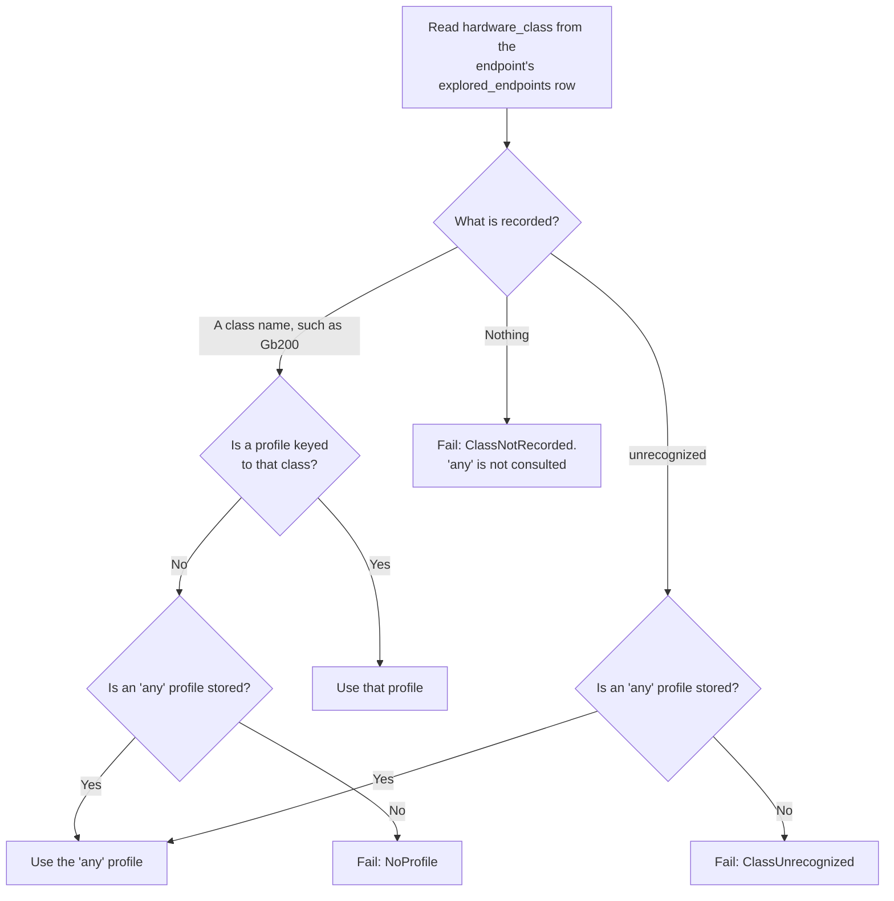
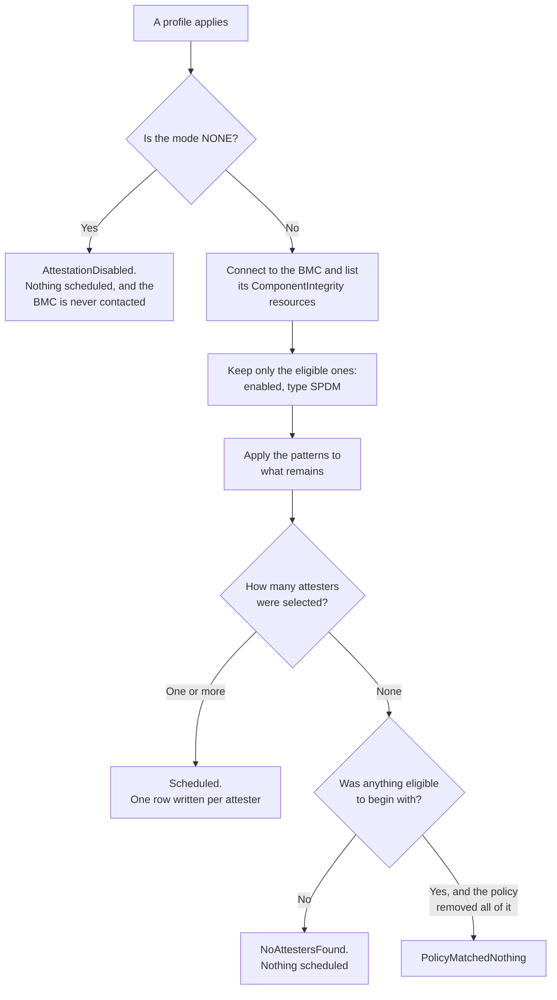
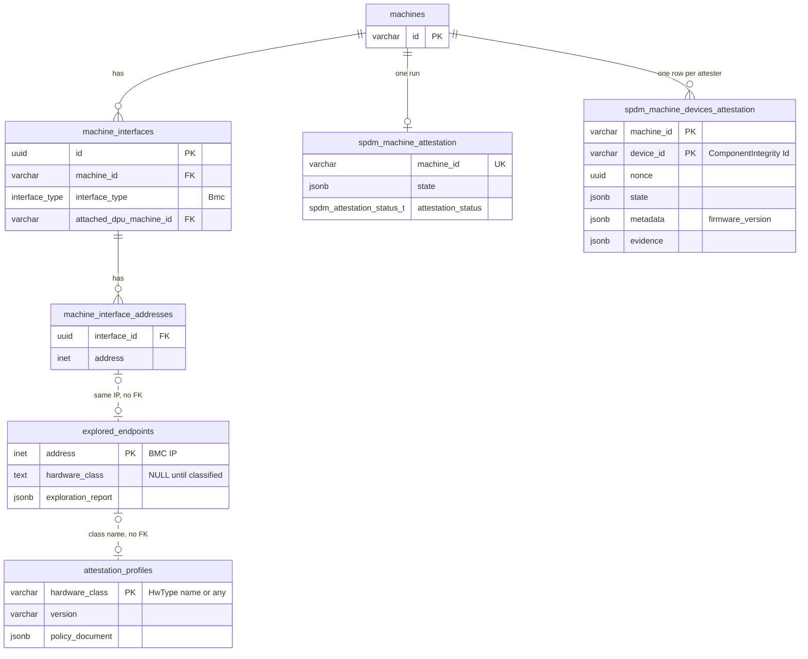

# Machine Attestation Profiles

**Implements:** [NVIDIA/infra-controller#4772](https://github.com/NVIDIA/infra-controller/issues/4772)
— *SPEC-AS-12: Attestation Profiles*. Milestone v2.3.

**Status:** WIP

## Revision History

| Version | Date | Modified By | Description |
| :---: | :---: | :---- | :---- |
| 0.1 | 09/04/2026 | Binu Ramakrishnan | Initial version |

## 1 What this changes

NICo verifies that a machine's hardware is genuine by collecting cryptographic
evidence from chips inside it. Each such chip is an **attester**. NICo asks the
machine's BMC, which lists what it can reach as Redfish `ComponentIntegrity`
resources, picks the ones it wants, writes one row of work per attester, and a
background worker collects and verifies the evidence.

`spdm_enabled` defaults to `false` and no deployment has set it to `true`, so the
attestation tables are empty everywhere. Nothing below has to preserve current
behaviour.

### 1.1 Feature requirements

| #   | Feature                                                                              | Addressed in |
| --- | ------------------------------------------------------------------------------------ | ------------ |
| 1   | A new data structure, the Machine Attestation Profile                                | §4           |
| 2   | CRUD operations attached to it                                                       | §6           |
| 3   | enabling and disabling individual attesters                                          | §4.2         |
| 4   | The unique machine type / hardware class: GB300, a DPU model, an NVLink switch model | §4.1         |
| 5   | The scheduler consults the profile and attests only the right attesters              | §5           |
| 6   | Room to refine with attester details such as path or other parameters                | §4.4         |

## 2 The flow end to end

| #   | Step                                                                                                 | Where                                                             |
| --- | ---------------------------------------------------------------------------------------------------- | ----------------------------------------------------------------- |
| 1   | Exploration resolves each BMC's `HwType`                                                             | Exists. `hw_type()`, called by `nv_generate_exploration_report()` |
| 2   | The hardware class is recorded on that endpoint's row                                                | §5.1. The `explored_endpoints.hardware_class` column              |
| 3   | An operator writes a profile keyed to a hardware class                                               | §4, §6                                                            |
| 4   | Attestation resolves machine → BMC → class → profile, then writes one work row per selected attester | §5                                                                |
| 5   | The controller collects evidence per work row                                                        | Exists, unchanged                                                 |
| 6   | The evidence is verified and recorded                                                                | Exists, unchanged                                                 |

Steps 1 through 4 are this document's scope.

**Resolution goes through the BMC.** A machine row carries no class; its BMC
endpoint does. The scheduler goes from `machine_id` to that machine's BMC
address, reads the class off that endpoint's row, and looks up the profile.

**A DPU is its own machine.** A BlueField in DPU mode has its own machine row,
linked to its host through `machine_interfaces.attached_dpu_machine_id`, with its
own BMC endpoint, `HwType`, and profile. A GB200 host with two BlueField-3 DPUs
is three machines, each resolving independently. Attesting the host does not
attest its DPUs; each is triggered separately, and composing them into one run is
separate work (§12).

## 3 Terminology

| Term               | Meaning                                                                                                                            |
| ------------------ | ---------------------------------------------------------------------------------------------------------------------------------- |
| **Attester**       | One chip inside a machine that can produce evidence. A GPU root of trust, for example.                                             |
| **Hardware class** | A group of hardware sharing one profile, for example `Gb200`. It is a `HwType` variant name; see §5.1.                             |
| `any`              | The one reserved class an operator can write. A profile keyed `any` covers hardware with no profile of its own; see §4.2 and §5.3. |
| `unrecognized`     | The reserved class the explorer writes for hardware it could not classify; see §5.1.                                               |
| **Profile**        | The stored policy for one hardware class.                                                                                          |
| **Selection**      | The part of a profile naming which attesters are in or out.                                                                        |
| **Pattern**        | One matcher inside a selection: `exact` (a full ID) or `prefix` (every ID starting with a string).                                 |

## 4 The profile

### 4.1 The hardware class is the key

A profile is keyed by a hardware class, which is a `HwType` variant name. Section
5.1 lists all sixteen. The three kinds of hardware the issue names are
`LenovoGb300`, `Bluefield`, and `NvSwitch`.

Two of those are coarser than the issue's wording. `Bluefield` covers every
BlueField generation because `HwType` does not split BF3 from BF4, and
`NvSwitch` is whatever reports the `P3809` product. Splitting either is
`bmc-explorer`'s to do (§5.2); the new variants would bring their own class
names.

**The ODM is part of the class.** GB300 is three classes — `DgxGb300`,
`LenovoGb300`, and `SupermicroGb300` — because `HwType` resolves the three ODMs
separately. That matches the hardware: in the scrape-derived mocks each ODM gives
its BlueField-3 a different Redfish chassis ID, so their attester identifiers are
unlikely to match either.

### 4.2 Modes, and the `any` fallback

A selection has one mode and a list of patterns.

| Mode        | Meaning                                                                 |
| ----------- | ----------------------------------------------------------------------- |
| `NONE`      | Attest nothing. Attestation is disabled for this hardware.              |
| `ALL`       | Attest every attester the BMC reports.                                  |
| `ALLOWLIST` | Attest only the attesters matching a pattern.                           |
| `DENYLIST`  | Attest every attester the BMC reports, except those matching a pattern. |

One `mode` field holds one value.

**One reserved fallback:** `any`**.** A profile keyed `any` applies to a machine
whose own class has no profile. An exact class match always wins, so `any` is
consulted only after that lookup misses.

Seeding `any` with `mode: ALL`: whatever the BMC offers
on hardware nobody has profiled, attest it. Without a fallback, an unprofiled
class contributes nothing — the machine fails, and a failed machine is not an
attested one. Because an exact match wins, a `mode: NONE` profile on a real class
is how an operator says "this platform has nothing to attest," and it keeps the
`ALL` net off hardware that can never satisfy it. Power shelves and generic Dell hosts are
the cases to seed that way.

### 4.3 Patterns: exact and prefix

| Kind     | Matches                                  |
| -------- | ---------------------------------------- |
| `exact`  | One ID, matched in full.                 |
| `prefix` | Every ID starting with the given string. |

Each pattern is independently exact or prefix, and one selection may mix them.

Prefix exists because a GB200 tray reports several GPU roots of trust — the
fixture in `crates/redfish/src/libredfish/test_support.rs` shows
`HGX_IRoT_GPU_0`, `HGX_IRoT_GPU_1`, and `HGX_IRoT_GPU_2` alongside `HGX_BMC_0` —
and one prefix covers them however many a tray has.

### 4.4 The policy is a JSON document

The profile row stores its policy as one JSON document. Here is `Gb200`,
attesting every GPU root of trust plus one named CPU root of trust, and a
denylist excluding a single component:

```json
{
  "schema_version": 1,
  "selection": {
    "mode": "ALLOWLIST",
    "component_ids": [
      { "prefix": "HGX_IRoT_GPU_" },
      { "exact": "VERA_CPU_0" }
    ]
  }
}
```

```json
{
  "schema_version": 1,
  "selection": {
    "mode": "DENYLIST",
    "component_ids": [
      { "exact": "HGX_BMC_0" }
    ]
  }
}
```

Each entry carries exactly one key, `exact` or `prefix`.

Using json makes it easy to update fields without a migration, and `schema_version`
tells a reader which shape it has.

### 4.5 A selection says what must be attested

- **An allowlist is a requirement, per pattern.** Every pattern must match at
least one eligible attester. A profile requiring `HGX_IRoT_GPU_` and
`VERA_CPU_0` fails on a tray reporting GPUs but no `VERA_CPU_0`. It is not
"attest the empty set."
- **A denylist matching nothing is fine.** Denying `HGX_BMC_0` on a tray that has
none excludes nothing. The asymmetry follows the direction of the mistake: an
unsatisfied allowlist pattern attests *less* than intended, a denylist matching
nothing attests *more*.
- **A denylist that excludes everything fails.** An operator who wants nothing
attested writes `NONE`.
- `ALL` **matching nothing schedules nothing, and is not a failure.** `ALL` states
no requirement, so there is nothing to leave unsatisfied. A BMC reporting no
eligible components already means no attestation work today, whatever the
profile.
- **An attester matched by two patterns is attested once.**
- **Matching is case-sensitive,** because Redfish treats `Id` as opaque.
- **Prefer exact patterns in denylists.** A prefix excludes whatever appears
under it in future: deny `HGX_IRoT_GPU_` and a later `HGX_IRoT_GPU_MEZZ_0` is
excluded too.

A selection is a requirement rather than a filter over a discovered list, which
also keeps it expressible for RMS, whose eventual switch support has no call to
list attesters before collecting.

## 5 Resolving the class and scheduling

1. Check `spdm_enabled`. If false, stop.
2. Resolve the machine to its BMC address from `machine_interfaces`, as the
  existing worker does.
3. Read `hardware_class` off that endpoint's `explored_endpoints` row.
4. Find the policy: the class first, then `any`. If neither yields one, stop with
  the matching failure from §5.3.
5. If the policy is `mode: NONE`, stop and report `AttestationDisabled`. The BMC
  is not contacted.
6. Connect to the BMC and list its `ComponentIntegrity` resources.
7. Keep the eligible ones: `ComponentIntegrityEnabled` true and type `SPDM`.
   Eligibility comes before patterns because an ID says nothing about whether
   the component can be attested. `ComponentIntegrityTypeVersion` is recorded,
   not filtered on, which drops the `1.1.0` check in today's `get_supported_components()`.
8. Apply the selection's patterns to what remains and take the outcome from
  §5.3.
9. On success, write one `spdm_machine_devices_attestation` row per selected
  attester — keyed `(machine_id, device_id)`, where `device_id` is that
  attester's `ComponentIntegrity` `Id` — which the existing controller picks up.

Step 6 is a live call because `ComponentIntegrity` is stored nowhere, so a pattern
cannot be checked against real hardware until scheduling time (§12).

### 5.1 Where the hardware class comes from

`bmc_explorer::hw_type()` already resolves a `HwType` and distinguishes all three
GB300 ODMs, but `nv_generate_exploration_report()` keeps only
`hw_type.bmc_vendor()`, under which a GB200 and a DGX GB300 both reduce to
`Nvidia`. Two changes make the full answer usable.

The hardware class string *is* the `HwType` variant name, derived with
`strum_macros::Display`, so there is no mapping to maintain.

The sixteen classes differ in how specific they are. Seven name platforms, so an
allowlist naming individual attesters means something for them:

`Gb200`, `DgxGb300`, `LenovoGb300`, `SupermicroGb300`, `VeraRubin`, `NvSwitch`,
`Bluefield`

The rest name whoever wrote the BMC firmware, not a hardware model — `Dell` says
a machine runs a Dell BMC, not which Dell machine — so they realistically carry
only `ALL` or `NONE`:

`Ami`, `Dell`, `Hpe`, `Lenovo`, `LenovoAmi`, `Supermicro`, `Viking`,
`LiteonPowerShelf`, `DeltaPowerShelf`

Expect `any` to cover most of a site's inventory at first.

A nullable `hardware_class` column on `explored_endpoints` holds it, written by
the same two statements that write the report (§7.2). The column's three states
are exactly the three the lookup needs to tell apart:

| Value          | Meaning                                | Lookup                  |
| -------------- | -------------------------------------- | ----------------------- |
| A class name   | `hw_type()` resolved it                | Key the profile on it   |
| `unrecognized` | Classification ran and matched nothing | Fall back to `any`      |
| `NULL`         | No exploration has recorded a class    | Fail `ClassNotRecorded` |

The explorer writes `unrecognized` when `hw_type()` returns `None`. `any` and `unrecognized`
are the reserved names and `unrecognized` is not writable as a profile key (§6.2).

### 5.2 Two `HwType` gaps this design does not close (yet)

Each is a `bmc-explorer` change, and each fails closed here rather than producing
a wrong attestation.

- `HwType::Bluefield` does not distinguish BF3 from BF4, so the two cannot have
different profiles. `bmc_explorer::is_bf4_product()` already makes the
distinction and is unit-tested for the `B4240V` and `BlueField-4` spellings.
- `Gb200` is what any NVIDIA `GB BMC` host resolves to when it is not a GB300, so
such a host loads the GB200 profile instead of failing to resolve.

For this feature implementation, we are decoupling the HwType resolution from
profile feature that enable us to address HwType issues separately.

### 5.3 Which policy applies, and how it can end

Two questions in order: which profile applies, then what did it select.

#### Which profile applies

One rule: **an exact class match always wins over** `any`**.**



Section 6.4 shows these same situations against a real inventory.

#### Policy selector and outcome

The profile from the previous step carries forward, including whether `any`
supplied it.



A pattern matching no eligible attester fails the selection before anything is counted.

`mode: NONE` never contacts the BMC, and eligibility is applied before the
patterns, both for the reasons in §5 steps 5 and 7.

A BMC that cannot be reached produces no outcome at all. It stays the retried
error it is today.

`PolicyMatchedNothing` means an operator-authored requirement went unsatisfied:
an allowlist pattern matching no eligible attester, or a denylist excluding
everything. The error names what went unsatisfied, including components that
matched but failed eligibility — diagnostic detail, not a separate outcome.

`NoAttestersFound` is not a verdict. It records that the BMC had nothing
attestable to offer, which is what such hardware already does today. `ALL` and a
denylist both report it, since neither asserts that a component must be there
and neither caused the emptiness; an allowlist does assert that, so it fails
instead.

There are three switches and no others: `spdm_enabled` for the site, `mode: NONE`
on a real class for one platform, and `any` for everything unprofiled.

## 6 Managing profiles

### 6.1 The RPCs

```protobuf
rpc CreateAttestationProfile(CreateAttestationProfileRequest) returns (AttestationProfile);
rpc UpdateAttestationProfile(UpdateAttestationProfileRequest) returns (AttestationProfile);
rpc DeleteAttestationProfile(DeleteAttestationProfileRequest) returns (DeleteAttestationProfileResponse);
rpc GetAttestationProfile(GetAttestationProfileRequest) returns (AttestationProfile);
rpc ListAttestationProfiles(google.protobuf.Empty) returns (ListAttestationProfilesResponse);
rpc GetAttestationCoverage(google.protobuf.Empty) returns (GetAttestationCoverageResponse);
```

```protobuf
message AttesterSelection {
  AttesterSelectionMode mode = 1;
  // Required for ALLOWLIST and DENYLIST, and must be empty for ALL and NONE.
  repeated ComponentIdMatch component_ids = 2;
}

message ComponentIdMatch {
  oneof pattern {
    string exact = 1;
    string prefix = 2;
  }
}

enum AttesterSelectionMode {
  // Zero is not a real mode: an omitted one would otherwise read as NONE and
  // silently disable attestation for the class.
  ATTESTER_SELECTION_MODE_UNSPECIFIED = 0;
  ATTESTER_SELECTION_MODE_NONE = 1;
  ATTESTER_SELECTION_MODE_ALL = 2;
  ATTESTER_SELECTION_MODE_ALLOWLIST = 3;
  ATTESTER_SELECTION_MODE_DENYLIST = 4;
}

message AttestationProfile {
  string hardware_class = 1;
  string version = 2;              // ConfigVersion
  AttesterSelection selection = 3;
  google.protobuf.Timestamp updated_at = 4;
  string updated_by = 5;
}

message CreateAttestationProfileRequest {
  string hardware_class = 1;
  AttesterSelection selection = 2;
}

message UpdateAttestationProfileRequest {
  string hardware_class = 1;
  AttesterSelection selection = 2;
  optional string if_version_match = 3;
}

message DeleteAttestationProfileRequest {
  string hardware_class = 1;
  optional string if_version_match = 2;
}

message DeleteAttestationProfileResponse {}
```

The coverage read (§6.4) reports the §5.3 rule applied to each class the site
has, so a caller does not restate it:

```protobuf
enum AttestationCoverage {
  ATTESTATION_COVERAGE_UNSPECIFIED = 0;
  ATTESTATION_COVERAGE_OWN_PROFILE = 1;
  ATTESTATION_COVERAGE_ANY_FALLBACK = 2;
  ATTESTATION_COVERAGE_NO_PROFILE = 3;
  ATTESTATION_COVERAGE_CLASS_UNRECOGNIZED = 4;
  ATTESTATION_COVERAGE_CLASS_NOT_RECORDED = 5;
}

message AttestationCoverageEntry {
  // Empty for the endpoints exploration has recorded no class for.
  string hardware_class = 1;
  int32 endpoints = 2;
  AttestationCoverage coverage = 3;
  // The mode that would apply, absent when nothing would.
  optional AttesterSelectionMode mode = 4;
}

message GetAttestationCoverageResponse {
  repeated AttestationCoverageEntry entries = 1;
  // Absent when no `any` profile is stored.
  optional AttesterSelectionMode any_profile_mode = 2;
}
```

`updated_by` is a response field only; the server derives it (§7.1).

### 6.2 Validation rules

- `hardware_class` must be non-empty. `any` is accepted, with no extra restriction
on its `mode`.
- `unrecognized` is rejected as a `hardware_class`. It is the explorer's marker
(§5.1), and §5.3 covers that hardware through `any`, so a profile keyed to it
would never be read.
- `mode` must be set. There is no safe default.
- `component_ids` must be non-empty for `ALLOWLIST` and `DENYLIST`, and empty for
`ALL` and `NONE`. An allowlist of nothing can never be satisfied; a denylist of
nothing means `ALL`.
- Every entry must set `pattern`, with a non-empty `exact` or `prefix` value. An
empty prefix matches every ID, which already has proper spellings in `ALL` and
`NONE`.
- `schema_version` is `1`. It is not a request field: the server sets it when it
builds the document, and a document carrying any other value is refused on the
way to storage.
- Creating a profile for a `hardware_class` that already has one is an error. Use
update. This also makes `any` unique.
- Update and delete against a `hardware_class` with no profile are not found.
- `if_version_match` is optional on update and delete. When supplied it must
match the stored version, and the write changes nothing otherwise
(`ConcurrentModificationError`). When omitted the write proceeds.

One invariant belongs in code rather than this list: the `HwType` rendering must
never produce `any` or `unrecognized` (§5.1).

### 6.3 The admin CLI

The commands sit under the existing `attestation spdm` group, alongside the
`trigger`, `get`, `list`, and `cancel` commands that act on the machines these
profiles decide:

```text
nico-admin-cli attestation spdm profile list
nico-admin-cli attestation spdm profile get <hardware-class>
nico-admin-cli attestation spdm profile create <hardware-class> --mode allowlist --prefix HGX_IRoT_GPU_
nico-admin-cli attestation spdm profile update <hardware-class> --mode denylist --exact HGX_BMC_0 [--if-version-match <version>] [--force]
nico-admin-cli attestation spdm profile delete <hardware-class> [--if-version-match <version>] [--force]
nico-admin-cli attestation spdm coverage
```

Patterns are two repeatable flags, `--exact <id>` and `--prefix <string>`, so a
selection can mix them:

```text
nico-admin-cli attestation spdm profile create Gb200 --mode allowlist --prefix HGX_IRoT_GPU_ --exact VERA_CPU_0
```

A command line does not record the order two flags were interleaved in, so the
patterns are sent `--exact` values first and then `--prefix` ones, each in the
order given.

`--mode allowlist` and `--mode denylist` require at least one pattern flag;
`--mode all` and `--mode none` reject both. That is enforced by the server
alone, so the CLI holds no inter-flag rule that would have to agree with it.
`--if-version-match` is optional; `get` and `list` print the version it takes.

`create` refuses a hardware class exploration never records (§6.2) before it
sends anything, naming the classes that would have worked. The server refuses it
too; checking locally spends no round trip on a misspelling.

**Edits that stop attesting hardware not named on the command line require**
`--force`. Those are exactly two: switching `any` to `--mode none`, and deleting
`any`. Both leave every class without a profile of its own attesting nothing.
Everything else writes unprompted, including `any` with `--mode all`, and
`--mode none` on a single class, which stops attesting only the class named.

```text
$ nico-admin-cli attestation spdm profile delete any
error: generic error: removing the 'any' fallback leaves every hardware class
       without a profile of its own attesting nothing; re-run with --force to
       confirm
```

`attestation spdm trigger` prints what §5.3 decided for the machine: the
outcome, the hardware class resolved for it, and the profile version that
applied. A trigger that schedules nothing still succeeds, so without the outcome
its response cannot be told from one that scheduled work.

These are Clap declarations under `crates/admin-cli/src/`. The reference pages
are generated, so run `cargo make gen-cli-docs` and `cargo make check-cli-docs`
after changing them.

### 6.4 Seeing coverage before enabling

Which classes a site has is not written down anywhere, and §5.3 makes enablement
depend on it. One read-only view groups `explored_endpoints` by `hardware_class`
and resolves each group against the profile table:

```text
$ nico-admin-cli attestation spdm coverage
+---------------------+--------------------+-------------+-----------------------------------------------------------+
| HARDWARE CLASS      | EXPLORED ENDPOINTS | OWN PROFILE | WOULD USE                                                 |
+=====================+====================+=============+===========================================================+
| Gb200               | 72                 | yes         | its own profile (allowlist)                               |
+---------------------+--------------------+-------------+-----------------------------------------------------------+
| LenovoGb300         | 18                 | no          | any (all)                                                 |
+---------------------+--------------------+-------------+-----------------------------------------------------------+
| Dell                | 4                  | yes         | its own profile (none)                                    |
+---------------------+--------------------+-------------+-----------------------------------------------------------+
| unrecognized        | 2                  | no          | any (all)                                                 |
+---------------------+--------------------+-------------+-----------------------------------------------------------+
| (no class recorded) | 1                  | n/a         | nothing: no class recorded; explore these endpoints again |
+---------------------+--------------------+-------------+-----------------------------------------------------------+
| any                 | —                  | yes         | its own profile (all)                                     |
+---------------------+--------------------+-------------+-----------------------------------------------------------+
```

Eighteen Lenovo GB300 trays would be attested by the fallback rather than by a
profile describing their real components, two endpoints are outside the taxonomy,
and one needs re-exploring. The `any` row is listed so the site's posture is
visible rather than inferred, and the unparenthesised rows are values actually
stored in `hardware_class`.

`EXPLORED ENDPOINTS` counts rows of `explored_endpoints` rather than machines,
because `hardware_class` is recorded per endpoint and a machine can present more
than one. Hardware nobody has explored has no row at all.
`OWN PROFILE` is `n/a` where no profile may be keyed to the row at all,
which is the `unrecognized` marker (§6.2) and the endpoints carrying no class.
The `any` row carries no count, because `any` is never recorded on an endpoint.

`WOULD USE` is the §5.3 rule applied per group, not a second implementation of
it: the server reports which profile would supply the policy, and the CLI only
spells it. The view contacts no BMC, so it cannot say whether a policy matches
real components (§12).

`--format json` and `--format yaml` report the same rows, with the class absent
rather than labelled for the endpoints carrying none, and the count absent on
the `any` row. `--format csv` is refused.

### 6.5 What editing a profile does not do

A profile is consulted once, when attestation is scheduled. Changing one affects
attestations scheduled afterwards and does not alter those already scheduled or
in flight. Deleting one does not cancel scheduled work.

## 7 Storage

### 7.1 Migration

```sql
-- The hardware class resolved at discovery. NULL means classification has not run
-- for this endpoint yet; 'unrecognized' means it ran and matched no HwType.
ALTER TABLE explored_endpoints ADD COLUMN hardware_class TEXT;
```

Additive and nullable, so it needs no backfill: Site Explorer fills it in as it
re-probes. Until it has, the endpoint's class is absent rather than wrong, which
§5.3 reports as its own outcome.

### 7.2 The profile table

```sql
-- Attestation profiles: one row per hardware class, naming which attesters
-- machines of that class require. The key is a HwType variant name, or the
-- reserved 'any'.
CREATE TABLE attestation_profiles (
    hardware_class  text         PRIMARY KEY,
    version         varchar(64)  NOT NULL,
    policy_document jsonb        NOT NULL,
    updated_at      timestamptz  NOT NULL DEFAULT now(),
    updated_by      varchar(256) NOT NULL
);
```

`version` is a `ConfigVersion`. A write matches on the caller's
`if_version_match` and stores `increment()`. Delete removes the row, so a later
create for the same class starts at `initial()`; the token carries a timestamp,
so that new `V1` does not match the old one.

`updated_by` records one identity: `Principal::audit_identity()` for the
request's principal, from the `AuthContext` `principals: Vec<Principal>`.

`hardware_class` carries no foreign key, because there is no table of hardware
classes: the class is a string on each endpoint's row (§7.3). Rejecting the
reserved `unrecognized` stays in the API (§6.2) rather than a `CHECK`, so the
reserved-name list lives in one place in Rust.

### 7.3 The existing tables

Relevant columns only; all as they are on `main`.

```sql
-- Where the hardware class is read from. Keyed by BMC IP.
explored_endpoints (
    address            inet NOT NULL PRIMARY KEY,
    exploration_report jsonb NOT NULL,
    hardware_class     text             -- added by batch 3; NULL until classified
)

-- One attestation run per machine.
spdm_machine_attestation (
    machine_id         varchar NOT NULL UNIQUE REFERENCES machines(id),
    requested_at       timestamptz NOT NULL,
    state              jsonb NOT NULL,
    attestation_status spdm_attestation_status_t NOT NULL DEFAULT 'not_started'
)

-- One work row per selected attester. Written by §5 step 9.
spdm_machine_devices_attestation (
    machine_id  varchar NOT NULL,
    device_id   varchar NOT NULL,       -- the ComponentIntegrity Id
    nonce       uuid NOT NULL,          -- fresh, per attester
    state       jsonb,                  -- SpdmAttestationState
    metadata    jsonb,                  -- firmware_version, fetched at FetchMetadata
    evidence    jsonb,
    ca_certificate jsonb,
    PRIMARY KEY (machine_id, device_id)
)

-- How a machine resolves to the BMC that answers for it.
machine_interfaces (
    id             uuid NOT NULL PRIMARY KEY,
    machine_id     varchar(64),
    interface_type interface_type NOT NULL,  -- 'Bmc' for the BMC NIC
    attached_dpu_machine_id varchar(64)      -- host row -> its DPU machine row
)
machine_interface_addresses (
    interface_id uuid,
    address      inet
)
```

`spdm_attestation_status_t` is `not_started`, `started`, `not_supported`,
`device_list_mismatch`, `completed`. `spdm_device_attestation_history` also
exists and is untouched.

### 7.4 How they connect



Two of those edges are dotted because they are joins on a value, not foreign
keys.

To read a machine's class, follow `machine_interfaces` where
`interface_type = 'Bmc'`, take that interface's address from
`machine_interface_addresses`, and look up `explored_endpoints` by it — the join
the existing worker already performs to find the BMC. The class then keys
`attestation_profiles` directly.

Because neither edge is a foreign key, a profile can name a class no hardware
reports and hardware can report a class with no profile. Nothing in the schema
detects either; §6.4's coverage report is what reconciles them.

A DPU in DPU mode is its own row in `machines` with its own BMC interface, so it
resolves its own class and profile. `attached_dpu_machine_id` is only what links
it to its host (§12).

## 8 The trigger API

`TriggerMachineAttestation` keeps its signature. Five response fields are added,
which does not break clients.

```protobuf
message SpdmMachineAttestationTriggerResponse {
  common.MachineId machine_id = 1;
  int32 devices_under_attestation = 2;
  string resolved_hardware_class = 3;
  SpdmSchedulingOutcome outcome = 4;
  bool used_any_fallback = 5;
  optional string profile_version = 6;
  optional google.protobuf.Timestamp scheduled_at = 7;
}
```

`outcome` is an enum of the §5.3 values rather than a string, so the schema
carries them and a client switching on it is exhaustive. `used_any_fallback` is
needed separately because

`resolved_hardware_class` reports the machine's class either way, so without it the
response cannot distinguish a policy written for this hardware from a default
written for everything else. Without all three, an operator testing a profile has
to infer from a count whether it was applied.

`profile_version` names the revision that decided. Reading the profile
separately does not answer this: profiles are editable, so the one an operator
reads before or after a trigger may not be the one that ran. It is `optional`
because `class_not_recorded`, `no_profile`, and `class_unrecognized` are
reached before any profile applies, so they have no version to report, and an
empty string would read as unknown rather than none.

It answers "which policy produced this response", not "which policy the machine
is attesting under".

`scheduled_at` tells a caller whether the devices it scheduled are still the
ones the machine has. Scheduling stamps every device row it writes with the
same `started_at`, so a caller that still finds its own value there knows
nothing has replaced it.

What a caller does with a failing outcome is not decided here; that belongs to
whatever drives host ingestion, firmware update, and tenant switching (§12).

## 9 Removing the old list

`is_supported_product()`, `get_supported_components()`, and the `PRODUCT_GB200`
and `PRODUCT_GB300` constants are deleted along with the version check they
carried, which no profile can express and none needs.

## 10 Logging and metrics

Scheduling outcomes are worth counting and alerting on, so scheduling emits a
declared event rather than a plain log line.

```rust
#[derive(carbide_instrument::Event)]
#[event(event_name = "attestation_scheduled",
    metric_name = "carbide_attestation_scheduling_total",
    component = "machine-controller", log = info, metric = counter,
    message = "SPDM attestation scheduling finished",
    describe = "Number of SPDM attestation scheduling attempts, by outcome")]
struct AttestationScheduled {
    #[label] outcome: SchedulingOutcome,
    #[context] machine_id: MachineId,
    #[context] hardware_class: String,
    #[context] used_any_fallback: bool,
    #[context] profile_version: Option<String>,
    #[context] devices_scheduled: u64,
}
```

`outcome` is a fixed enum of the §5.3 values, so it is safe as a label, and it is
the only one: a site accumulating unprofiled hardware is a count of machines in a
state, which the coverage view answers directly, where this metric counts
occurrences.

Machine IDs are unbounded and stay in `#[context]`. Class names stay there too:
the explorer writes the column, so nothing at the emit site bounds what a stored
row can contain.

A profile is security policy, so every accepted change to one is recorded with
the version it moved from and to.

```rust
#[derive(carbide_instrument::Event)]
#[event(event_name = "attestation_profile_changed",
    metric_name = "carbide_attestation_profile_changes_total",
    component = "nico-api", log = info, metric = counter,
    message = "Attestation profile changed",
    describe = "Number of accepted attestation profile create, update, and delete operations, by operation.")]
struct AttestationProfileChanged {
    #[label] operation: AttestationProfileOperation,  // Created, Updated, Deleted
    #[context] hardware_class: String,
    #[context] from_version: Option<String>,          // None on create
    #[context] to_version: Option<String>,            // None on delete
    #[context] updated_by: String,
    #[context] policy_document: Option<String>,       // the new document; None on delete
}
```

`operation` is the only label: it is a closed three-variant enum.

Emitted from the three mutating RPCs in §6.1 after the write commits, so the
trail records what took effect. A rejected `if_version_match` or a §6.2
validation failure changes nothing and surfaces as an ordinary API error.

Together with `version`, this gives an ordered per-class history in the logs:
`from_version` and `to_version` chain, so a gap means a record was lost rather
than a change going unrecorded. It is a log trail, not a queryable one — it ages
out with log retention.

## 11 Testing

| Req                                       | Tests                                                                                                                                                                                                                                                                                                                                                                                                                                      | Layer                                            |
| ----------------------------------------- | ------------------------------------------------------------------------------------------------------------------------------------------------------------------------------------------------------------------------------------------------------------------------------------------------------------------------------------------------------------------------------------------------------------------------------------------ | ------------------------------------------------ |
| 1 The profile (§4)                        | A policy document is stored and read back unchanged, and every §6.2 validation rule is refused                                                                                                                                                                                                                                                                                                                                             | Unit, then the API boundary                      |
| 2 CRUD (§6)                               | Create, update, delete, get and list reflect each step; `version` increments; a stale `if_version_match` is refused on update and on delete while an omitted one proceeds; a second create for one class fails; an unknown `schema_version` is refused                                                                                                                                                                                                                                                                                 | API and database                                 |
| 3 Enabling and disabling attesters (§4.2) | Against `HGX_IRoT_GPU_0/1/2` and `HGX_BMC_0`: an allowlist of `prefix: HGX_IRoT_GPU_` selects the three GPUs and not the BMC, a denylist of `exact: HGX_BMC_0` selects the same three, `ALL` selects four, `NONE` selects none. Mixed patterns take the union, overlapping ones select once, and `hgx_irot_gpu_` selects nothing. Per §4.5, an allowlist pattern matching nothing fails while a denylist pattern matching nothing does not | Pure function over a policy and a component list |
| 4 The hardware class (§4.1)               | Every `HwType` variant renders a distinct non-empty string, asserted against literal spellings since profiles are keyed to them, and none renders `any` or `unrecognized`; each GB300 ODM records its own class; hardware `hw_type()` does not recognise records `unrecognized`; an unclassified endpoint stays `NULL`                                                                                                                     | Unit, then the explorer against mock BMCs        |
| 5 The scheduler consults the profile (§5) | With `spdm_enabled` on, a mock GB200 tray resolves its class, finds its profile, and gets one work row per selected attester; every §5.3 outcome is reached, and a failing one writes nothing                                                                                                                                                                                                                                              | Attestation integration                          |
| 6 Room to refine (§4.4)                   | A document written today reads back with its `schema_version`, so a later shape can be told apart from this one                                                                                                                                                                                                                                                                                                                            | Unit                                             |

Four cases where an assertion can pass while the behaviour is wrong:

- `AttestationDisabled` must produce no work **and** no failure. A test
asserting only "no rows" also passes for `PolicyMatchedNothing`.
- A class whose own profile is `mode: NONE` must stay unattested with `any`
seeded to `ALL`. A precedence bug there silently attests hardware an operator
switched off.
- `ALL` selecting nothing gives `NoAttestersFound` and is not a failure, while an
unsatisfied allowlist on the same hardware gives `PolicyMatchedNothing`. The two
reasons for selecting nothing have to stay distinguishable.
- `ClassUnrecognized` and `ClassNotRecorded` must be reached separately, since
`any` covers the first while the second still fails. Drive the first through the
explorer against a mock it cannot classify, so it proves `hw_type()` returned
`None` rather than being handed a fixture.

## 12 Out of scope

Adjacent problems this surfaced. None is required by #4772, and each needs its
own ticket.

- **Per-subject outcomes under one run:** attesting a host covering its attached
DPU machines and reporting one result.
- **Attestation run identity,** so a late worker from an old attempt cannot write
onto a new one.
- **Storing** `ComponentIntegrity` **IDs at discovery,** so operators select
patterns from real data rather than authoring them blind.
- **What a failed verdict costs a gate:** what a bad result means for host
ingestion, firmware update, and tenant switching.
- **Attesting switches and NIC-mode BlueField cards,** neither of which has a
machine row.
- **Evidence collection through RMS,** needed for switches.
- **Per-attester error detail in the read API.**
- **Richer pattern matching:** glob, regex, substring.
